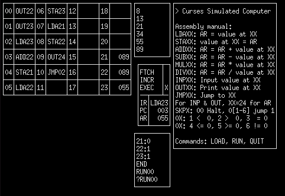

# Curses Simulated Computer II

An emulator of the 1983 Simulated Computer II software.
Not at feature parity, but mostly functional.




## Running

At this time, you must compile this program to run it.
This should run on any POSIX compliant computer, however it has only been tested on Linux.

This is a simple process, one you have the necessary tools installed.

You must install `ncurses`, `git`, the `gcc`, and `make`.
Depending on the flavor of Linux you are using, `ncurses` may have a separate `ncurses-devel` or similar package containing development dependencies for ncurses.

Then, execute these commands

```
git clone https://github.com/ehughsbaird/curses-simulated-computer.git
cd curses-simulated-computer
make
```

That will clone this repo, put you in this directory, and build the program.
Once that is done, simply run the program with `./simulated_computer`. Run `QUIT` once in the program to exit the program.

## Missing features

- Graphics manipulation
- Sound manipulation
- Many commands
